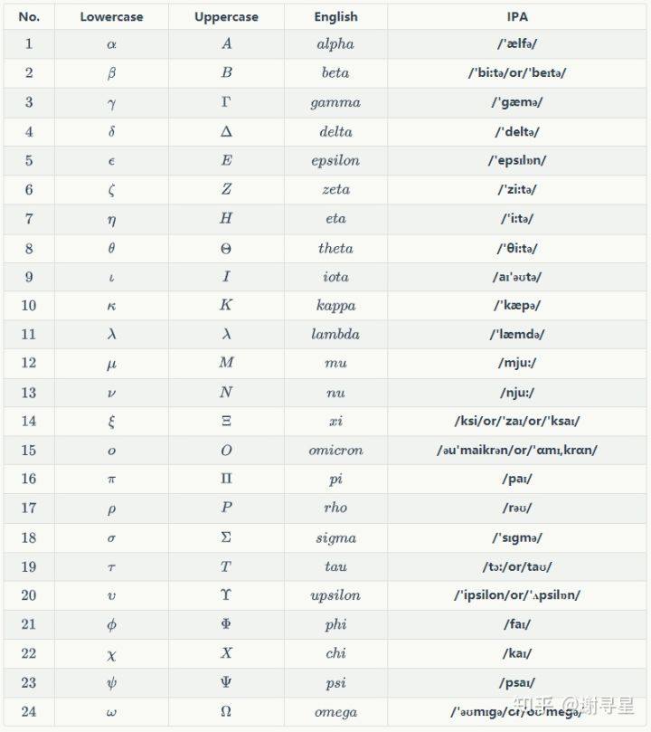

# Makedown笔记

## 一.文字

1. 文字的大小、颜色、更改字体
```
<font face="逐浪立楷" color=green size=10>我是逐浪立楷，绿色，尺寸为5</font>
```
<font face="逐浪立楷" color=green size=10>我是逐浪立楷，绿色，尺寸为5</font>

2. 下划线
```
<u>下划线</u>
```
<u>下划线</u>

## 二.支持 HTML 标签

### 段落缩进
```
&emsp;&emsp;111
```
&emsp;&emsp;111

### 页面跳转
```
[点我跳转](#anchor)
```
[点我跳转](#anchor)

## 三.表格

&emsp;&emsp;第二行的`---:`表示了对齐方式(左,右,居中)
```
|商品|数量|单价|
|---|---:|:---:|
|苹果|10|\$1|
|电脑|1|$1000|
```
|商品|数量|单价|
|---|---:|:---:|
|苹果|10|\$1|
|电脑|1|$1000|


## 四.数学公式

### 数学公式latex语法

使用`$`表示,其中一个\$表示在行内, 两个 \$ 表示独占一行.

例如质量守恒公式: $$E=mc^2$$
```
$$E=mc^2$$
```

支持**LaTeX**编辑显示支持, 例如$\sum_{i=1}^n a_i=0$,
```
$\sum_{i=1}^n a_i=0$
```


在线数学公式编译网站: 
[https://www.codecogs.com/latex/eqneditor.php]

[https://editor.codecogs.com/docs/2-CK_Editor_v4x.php]

[https://meta.math.stackexchange.com/questions/5020/mathjax-basic-tutorial-and-quick-reference]


### 常用函数

1. 分数
```
$\frac{}{}$
```
$\frac{}{}$

2. 分段函数
```
$$ 
函数名= \begin{cases}
公式1 & 条件1 \\
公式2 & 条件2 \\
公式3 & 条件3 
\end{cases}
$$
```
$$ 
函数名= \begin{cases}
公式1 & 条件1 \\
公式2 & 条件2 \\
公式3 & 条件3 
\end{cases}
$$

3.关系符号
- $\geq$      $\leq$
```
$\geq$      $\leq$
```

- $\in$      $\notin$
```
$\in$      $\notin$
```


## 五.希腊字母表

代码如下：
```
| No.  | Lowercase  | Uppercase  |  English  |              IPA              |
| :--: | :--------: | :--------: | :-------: | :---------------------------: |
| $1$  |  $\alpha$  |    $A$     |  $alpha$  |          **/'ælfə/**          |
| $2$  |  $\beta$   |    $B$     |  $beta$   |    **/'bi:tə/or/'beɪtə/**     |
| $3$  |  $\gamma$  |  $\Gamma$  |  $gamma$  |          **/'gæmə/**          |
| $4$  |  $\delta$  |  $\Delta$  |  $delta$  |         **/'deltə/**          |
| $5$  | $\epsilon$ |    $E$     | $epsilon$ |        **/'epsɪlɒn/**         |
| $6$  |  $\zeta$   |    $Z$     |  $zeta$   |         **/'zi:tə/**          |
| $7$  |   $\eta$   |    $H$     |   $eta$   |          **/'i:tə/**          |
| $8$  |  $\theta$  |  $\Theta$  |  $theta$  |         **/'θi:tə/**          |
| $9$  |  $\iota$   |    $I$     |  $iota$   |         **/aɪ'əʊtə/**         |
| $10$ |  $\kappa$  |    $K$     |  $kappa$  |          **/'kæpə/**          |
| $11$ | $\lambda$  | $\lambda$  | $lambda$  |         **/'læmdə/**          |
| $12$ |   $\mu$    |    $M$     |   $mu$    |          **/mju:/**           |
| $13$ |   $\nu$    |    $N$     |   $nu$    |          **/nju:/**           |
| $14$ |   $\xi$    |   $\Xi$    |   $xi$    |   **/ksi/or/'zaɪ/or/'ksaɪ/**  |
| $15$ | $\omicron$ |    $O$     | $omicron$ | **/əu'maikrən/or/'ɑmɪ,krɑn/** |
| $16$ |   $\pi$    |   $\Pi$    |   $pi$    |           **/paɪ/**           |
| $17$ |   $\rho$   |    $P$     |   $rho$   |           **/rəʊ/**           |
| $18$ |  $\sigma$  |  $\Sigma$  |  $sigma$  |         **/'sɪɡmə/**          |
| $19$ |   $\tau$   |    $T$     |   $tau$   |       **/tɔ:/or/taʊ/**        |
| $20$ | $\upsilon$ | $\Upsilon$ | $upsilon$ |  **/'ipsilon/or/'ʌpsilɒn/**   |
| $21$ |   $\phi$   |   $\Phi$   |   $phi$   |           **/faɪ/**           |
| $22$ |   $\chi$   |    $X$     |   $chi$   |           **/kaɪ/**           |
| $23$ |   $\psi$   |   $\Psi$   |   $psi$   |          **/psaɪ/**           |
| $24$ |  $\omega$  |  $\Omega$  |  $omega$  |   **/'əʊmɪɡə/or/oʊ'meɡə/**    |
```

预览如下：



&emsp;&emsp;在多数Markdown编辑器里是不支持表格内输入公式的。另外在LaTex里，大写的希腊字母应该是小写英文单词的第一个字母大写。

   


